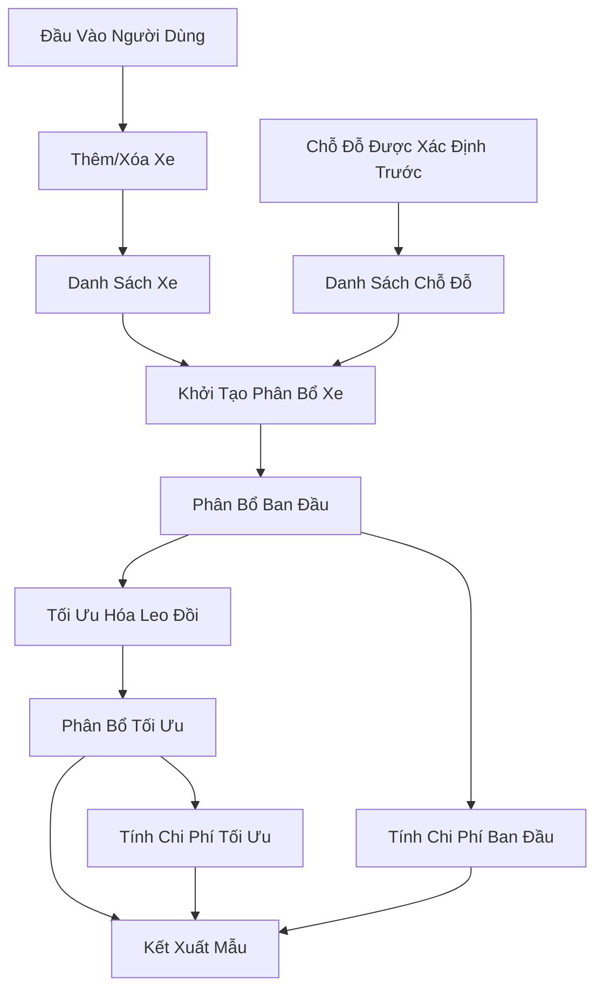
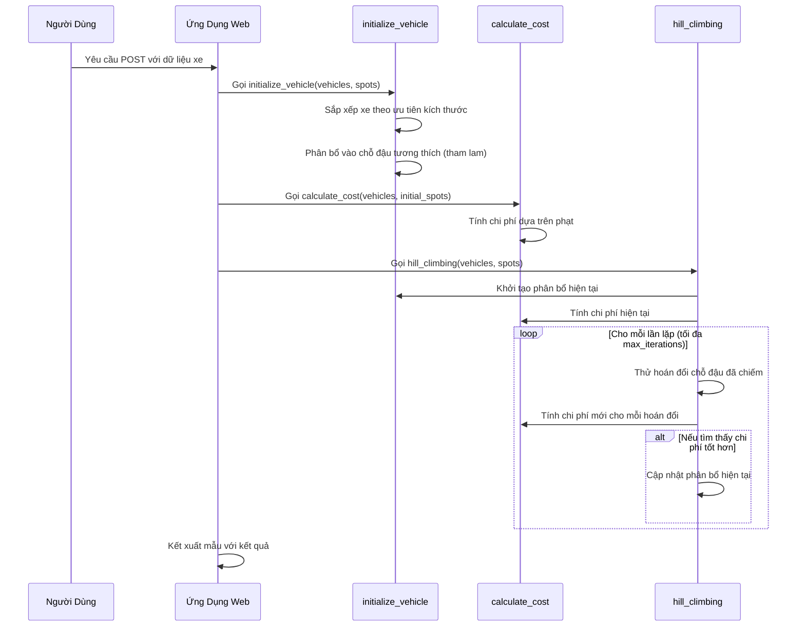

# Sơ Đồ Thuật Toán Leo Đồi

## Sơ Đồ Luồng Dữ Liệu



### Giải Thích:
- **Nguồn Dữ Liệu**: Người dùng nhập xe qua biểu mẫu web, chỗ đậu được xác định trước trong mã.
- **Quy Trình**: Quản lý xe (thêm/xóa), phân bổ ban đầu sử dụng phương pháp tham lam, tính chi phí, tối ưu hóa leo đồi thông qua hoán đổi hàng xóm.
- **Kho Dữ Liệu**: Danh sách xe và chỗ đậu được duy trì trong bộ nhớ.
- **Đầu Ra**: Phân bổ chỗ đậu tối ưu và chi phí được hiển thị trong mẫu web.

## Sơ Đồ Chuỗi Thực Thi



### Giải Thích:
- **Khởi Tạo**: Xe được sắp xếp theo kích thước và phân bổ vào chỗ đậu tương thích tốt nhất.
- **Tính Chi Phí**: Đánh giá phạt cho sự không khớp, xe chưa phân bổ, v.v.
- **Leo Đồi**: Lặp lại khám phá giải pháp hàng xóm bằng cách hoán đổi phân bổ xe giữa chỗ đậu, chấp nhận cải thiện cho đến khi không tìm thấy giải pháp tốt hơn hoặc đạt tối đa lần lặp.
- **Luồng Web**: Xử lý hành động người dùng, tính toán cả giải pháp ban đầu và tối ưu, hiển thị kết quả.

## Sơ Đồ Luồng Chạy Dự Án

```mermaid
flowchart TD
    A[Khởi động Flask App] --> B[app.run(debug=False)]
    B --> C[Chờ Request từ User]

    C --> D{HTTP Method?}
    D -->|GET /| E[Hiển thị form trống<br/>hoặc kết quả hiện tại]
    D -->|POST /| F[Nhận dữ liệu form]

    F --> G{Xử lý Action}
    G -->|add| H[_add_vehicle<br/>Thêm xe mới]
    G -->|remove| I[_remove_vehicle<br/>Xóa xe]
    G -->|clear| J[_clear_vehicles<br/>Xóa tất cả]

    H --> K[Cập nhật danh sách vehicles]
    I --> K
    J --> K

    K --> L{Có vehicles?}
    L -->|Không| M[Hiển thị form trống]
    L -->|Có| N[Tính toán phân bổ]

    N --> O[initialize_vehicle<br/>Phân bổ ban đầu - tham lam]
    O --> P[calculate_cost<br/>Tính chi phí ban đầu]
    P --> Q[hill_climbing<br/>Tối ưu hóa leo đồi]
    Q --> R[calculate_cost<br/>Tính chi phí tối ưu]

    M --> S[Kết xuất template]
    R --> S

    S --> T[Trả về HTML response]
    E --> T
    T --> C

    subgraph "Thuật Toán Hill Climbing"
        Q1[Khởi tạo current_spots]
        Q2[Lặp max_iterations lần]
        Q3[Duyệt tất cả cặp chỗ đậu<br/>đã có xe]
        Q4[Tạo bản sao new_spots]
        Q5[Hoán đổi xe giữa 2 chỗ]
        Q6[Tính chi phí mới]
        Q7{Chi phí < current_cost?}
        Q8[Cập nhật current_spots<br/>và current_cost]
        Q9{Kết thúc duyệt cặp?}
        Q10{Cải thiện được?}

        Q --> Q1
        Q1 --> Q2
        Q2 --> Q3
        Q3 --> Q4
        Q4 --> Q5
        Q5 --> Q6
        Q6 --> Q7
        Q7 -->|Có| Q8
        Q8 --> Q9
        Q7 -->|Không| Q9
        Q9 --> Q10
        Q10 -->|Có| Q2
        Q10 -->|Không| R
    end

    subgraph "Hàm calculate_cost"
        P1[Duyệt tất cả spots]
        P2[Đếm chỗ trống +1]
        P3[Đếm xe chưa phân bổ +50]
        P4[Kiểm tra không khớp kích thước +5]
        P5[Kiểm tra không khớp loại chỗ +10]
        P6[Kiểm tra độ khó lái xe]
        P7[Kiểm tra cấm xe lớn tầng hầm +100]
        P8[Tổng hợp chi phí]

        P --> P1
        P1 --> P2
        P2 --> P3
        P3 --> P4
        P4 --> P5
        P5 --> P6
        P6 --> P7
        P7 --> P8
    end
```

### Giải Thích Luồng Chạy:

1. **Khởi động**: Ứng dụng Flask bắt đầu và chờ request
2. **Xử lý Request**:
   - GET: Hiển thị giao diện
   - POST: Xử lý thêm/xóa xe
3. **Tính toán**: Nếu có xe, thực hiện phân bổ tối ưu
4. **Thuật toán**: Hill climbing lặp lại hoán đổi chỗ đậu để tìm giải pháp tốt hơn
5. **Đánh giá**: Tính chi phí dựa trên nhiều tiêu chí phạt
6. **Kết xuất**: Trả về HTML với kết quả

## Sơ Đồ Khởi Tạo và Chạy Thuật Toán

```mermaid
flowchart TD
    A[Nhận danh sách vehicles và spots] --> B[Tạo bản sao current_spots]
    B --> C[Gọi initialize_vehicle<br/>để phân bổ ban đầu]

    C --> D[Sắp xếp vehicles theo kích thước<br/>large → medium → small]
    D --> E[Khởi tạo available_spots = spots.copy]

    E --> F[Với mỗi vehicle trong danh sách đã sắp xếp]
    F --> G[Tìm compatible_spots<br/>có thể chứa vehicle này]
    G --> H{Có compatible_spots<br/>trống không?}

    H -->|Có| I[Chọn spot có driver_difficulty<br/>nhỏ nhất - tham lam]
    I --> J[Gán vehicle.id cho spot.occupied]
    J --> K[Xóa spot khỏi available_spots]

    H -->|Không| L[Bỏ qua vehicle này<br/>để hill climbing xử lý]

    K --> M{Còn vehicle<br/>chưa xử lý?}
    L --> M
    M -->|Có| F
    M -->|Không| N[Hoàn thành khởi tạo]

    N --> O[Tính current_cost = calculate_cost<br/>vehicles, current_spots]

    O --> P[Bắt đầu vòng lặp hill_climbing<br/>max_iterations = 100]

    P --> Q[Đặt improved = False]
    Q --> R[Duyệt từng cặp spots s1, s2<br/>có occupied != None]

    R --> S{s1.id != s2.id<br/>và cả hai có xe}
    S -->|Không| R
    S -->|Có| T[Tạo new_spots = copy.deepcopy<br/>current_spots]

    T --> U[Hoán đổi occupied giữa s1 và s2<br/>trong new_spots]
    U --> V[Tính new_cost = calculate_cost<br/>vehicles, new_spots]

    V --> W{new_cost < current_cost?}
    W -->|Có| X[Cập nhật current_cost = new_cost<br/>current_spots = new_spots<br/>improved = True<br/>break khỏi vòng trong]
    W -->|Không| Y[Tiếp tục với cặp tiếp theo]

    X --> Z{Kết thúc duyệt<br/>tất cả cặp?}
    Y --> Z
    Z --> AA{improved == True?}
    AA -->|Có| BB[Reset improved = False<br/>Tiếp tục vòng lặp chính]
    AA -->|Không| CC[Thoát vòng lặp<br/>Trả về current_spots, current_cost]

    BB --> DD{Vượt quá<br/>max_iterations?}
    DD -->|Chưa| P
    DD -->|Rồi| CC

    subgraph "Hàm initialize_vehicle"
        D
        E
        F
        G
        H
        I
        J
        K
        L
        M
        N
    end

    subgraph "Vòng lặp chính hill_climbing"
        P
        Q
        R
        S
        T
        U
        V
        W
        X
        Y
        Z
        AA
        BB
        DD
    end

    subgraph "Xử lý từng cặp spots"
        S
        T
        U
        V
        W
        X
        Y
    end
```



### Giải thích chi tiết:

#### **Giai Đoạn Khởi Tạo (initialize_vehicle):**
1. **Sắp xếp xe**: Theo ưu tiên kích thước (large trước để có nhiều lựa chọn)
2. **Phân bổ tham lam**: Với mỗi xe, chọn chỗ đậu tương thích có độ khó lái xe thấp nhất
3. **Xử lý không thể phân bổ**: Để lại cho thuật toán hill climbing xử lý sau

#### **Thuật Toán Hill Climbing:**
1. **Khởi tạo**: Bắt đầu với giải pháp từ initialize_vehicle
2. **Local search**: Duyệt tất cả cặp chỗ đậu đã có xe để hoán đổi
3. **Đánh giá**: Tính chi phí sau mỗi hoán đổi
4. **Cải thiện**: Chấp nhận hoán đổi nếu chi phí giảm
5. **Termination**: Dừng khi không tìm thấy cải thiện hoặc đạt max_iterations

#### **Đặc điểm thuật toán:**
- **Hill Climbing thuần**: Chỉ chấp nhận giải pháp tốt hơn, không tệ hơn
- **Deterministic**: Với cùng input luôn cho kết quả giống nhau
- **Local optimum**: Có thể mắc kẹt ở cực tiểu cục bộ
- **Thời gian**: O(max_iterations × n²) với n = số chỗ đậu

## Hình Ảnh Sơ Đồ
Các hình ảnh sơ đồ đã được tạo tự động và lưu trong thư mục dự án:

- `data_flow_diagram.png`: Sơ đồ luồng dữ liệu
- `execution_sequence_diagram.png`: Sơ đồ chuỗi thực thi

## Hướng Dẫn Tạo Hình Ảnh Thủ Công
Nếu cần tạo lại hình ảnh từ các sơ đồ Mermaid:
1. Sao chép mã Mermaid vào công cụ trực tuyến như https://mermaid.live/ hoặc https://mermaid-js.github.io/mermaid-live-editor/
2. Chọn "Download" hoặc "Export" để lưu dưới dạng PNG/SVG
3. Hoặc sử dụng tiện ích mở rộng VS Code Mermaid để xem trước và xuất hình ảnh